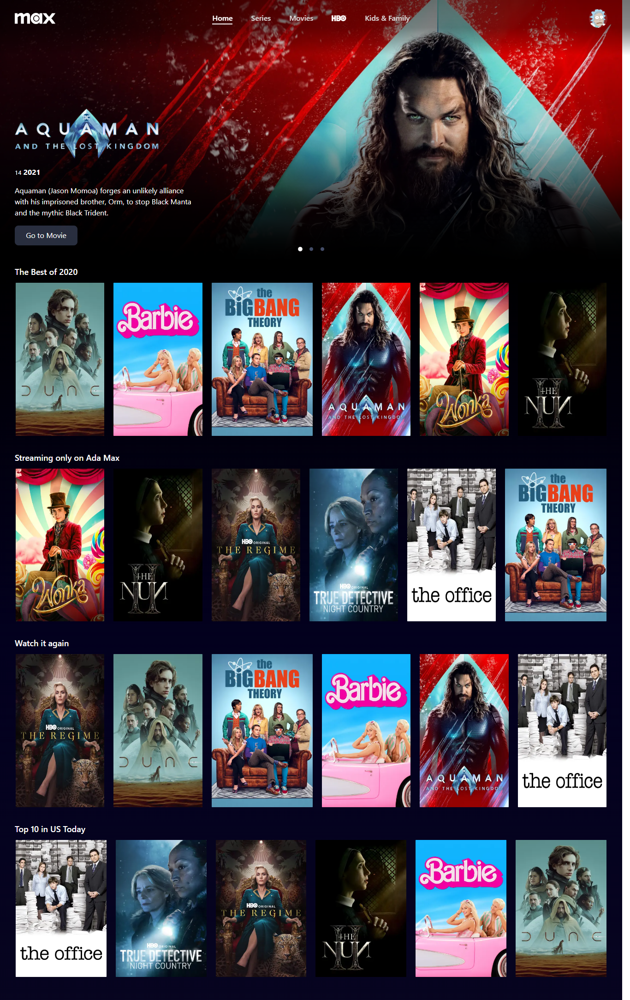

# Ada Max

Este é um projeto de conclusão do módulo **React II🔗** do curso Vem Ser Tech, um programa Ada Tech em parceria com o iFood.
O projeto consiste em um clone da plataforma ***max.com*** (antiga hbomax.com )web onde os usuários podem visualizar uma lista de receitas culinárias. Ele foi desenvolvido como parte do curso de React I.

## Screenshots 🖼

---

## Funcionalidades 📝

A aplicação "Ada Max" oferece as seguintes funcionalidades:

1. **Home:**

   - Mostra os banners dos filmes. Pegando de GET `/api/banners`;
   - [ ] (plus) Criar um carousel com os banners;
   - [ ] Mostrar os trilhos de ofertas. Pegando em GET `/api/trail-offers`;
   - [ ] No momento que o elmento da oferta entrar no viewport, chamamos o GET `/api/trail-offer/:id` então mostramos data um dos thumbs das ofertas

2. **Login:**

    - Tela de login com `email` e `password`;
    - Validação dos campos;
    - Faz chamada POST `/api/signIn`;
    - Quando BackEnd retorna 401: Mostrar mensagem de erro ex:`Credencias inválidas`
    - Quando BackEnd retorna 200: Redireciona para tela conforme o role do usuário;
      Se for `user` para tela `Profile` se `admin` para Backstage;

3. **Logout**

4. **Profile:**

    - Lista os profiles;
    - Cria um novo profile;
    - Altera um profile;
    - Remove um profile;
    - Após selecionado um profile, redirecionar para `/home`

## Ferramentas Utilizadas 🛠

As seguintes ferramentas foram escolhidas para o desenvolvimento deste projeto:

- **Linguagem de Programação:** TypeScript foi escolhido como a linguagem principal.
- **Biblioteca Front-End:** React.js foi utilizada para a criação da interface do usuário.
- **Estilização:** styled-components e css-modules foram utilizados para estilizar os componentes.
- **Navegação:** react-router-dom foi usado para a navegação entre páginas.
- **Axios:**  Foi usado para realizar requisições HTTP.
- **clsx:**  Para gerenciamento de classes CSS.
- **i18next:**  Para internacionalização das mensagens.
- **zod:**   Para validação dos dados recebidos pela API.
- **jose:** Para suporte à JSON Web Tokens (JWT).

## Como Rodar o Projeto Localmente 👨‍🔧

Para executar este projeto em seu computador local, siga estas etapas:

1. Clone este repositório:

   `git clone https://github.com/gabriel-fh/Projeto-Final-React-Modulo-2.git`

2. Navegue para o diretório do projeto:

   `cd Projeto-Final-React-Modulo-2.git`

3. Instale as dependências do projeto:

   `npm install`

4. Inicie o servidor de desenvolvimento:

   `npm run dev`

5. Abra seu navegador e acesse <http://localhost:5173> para visualizar a aplicação.

## Licença 📝

Este projeto está licenciado sob a [**MIT License**](./LICENSE).

## Equipe

<table>
  <tr>
    <td align="center">
      <a href="https://github.com/gabriel-fh" title="Perfil do Gabriel Hermenegildo no GitHub">
         
        
          <b>Gabriel Hermenegildo</b>
        
      </a>
    </td>
    <td align="center">
      <a href="https://github.com/GustavoCorreiaDev" title="Perfil do Gustavo Correia no GitHub">
         
        
          <b>Gustavo Correia</b>
        
      </a>
    </td>
    <td align="center">
      <a href="https://github.com/josephmatheus" title="Perfil do Joseph Matheus no GitHub">
         
        
          <b>Joseph Matheus</b>
        
      </a>
    </td>
    <td align="center">
      <a href="https://github.com/LucasFigs" title="Perfil do Lucas Figueredo no GitHub">
         
        
          <b>Lucas Figueredo</b>
        
      </a>
    </td>
    <td align="center">
      <a href="https://github.com/AndreasOtavio" title="Perfil do Otavio Andreas no GitHub">
         
        
          <b>Otavio Andreas</b>
        
      </a>
    </td>
  </tr>
</table>
